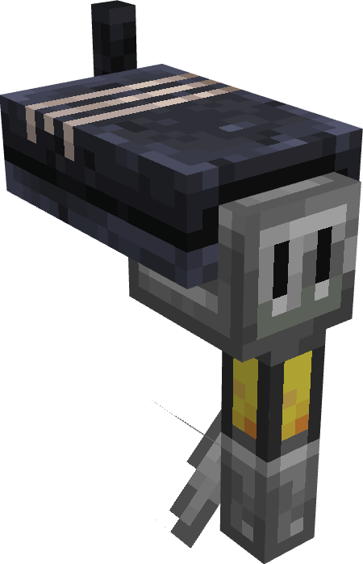

<h1>
    
    
    
</h1>

# Boatism Fabric Mod for Minecraft

Embark on a revolutionary journey across the seas with Boatism,
a fabric mod designed to improve your boating adventures in Minecraft!
Say goodbye to slow and tedious boat rides and embrace the thrill of high-speed travel
with our cutting-edge boat engine feature.

 

## Features

1. Add new Boat Engine Entities to your Boats. Simply hook them on your favourite Boat, fill up the gas and start the engine.
2. Travel faster by sea than ever before. Engine `Power Level 5` already exceeds the vanilla Boat speed!
3. Keep an eye and an ear out for your engine. Continuous high stress may cause unforeseen accidents!
4. Upgrade your engine with special custom parts.
    - Your fuel capacity is too small? Strap on an extra canister!
    - Is your engine overheating too fast? How about some better cooling options?
    - Your engine can't take a beating? Put on some plating, and it will tank any fall!
5. The engine's back-end code is built with mod compatibility in mind. Try hooking it up with custom mod boats and let us know how it went!

## Current state and plans for the future

The mod is, as of now, in a stable state and can be experimented with.
Due to a tight schedule, a lot of balancing and bug testing still has to be done, so make sure to let us know about possible issues
or feature requests in the [GitHub issues](https://github.com/JR1811/Boatism/issues).

## Contributors

Thank you to...

- [@Globox1997](https://github.com/Globox1997) (dev and ideas)
- [@0xJoeMama](https://github.com/0xJoeMama) (dev and ideas)
- Apfelrunder (ideas)

... and many more for your help!

 

